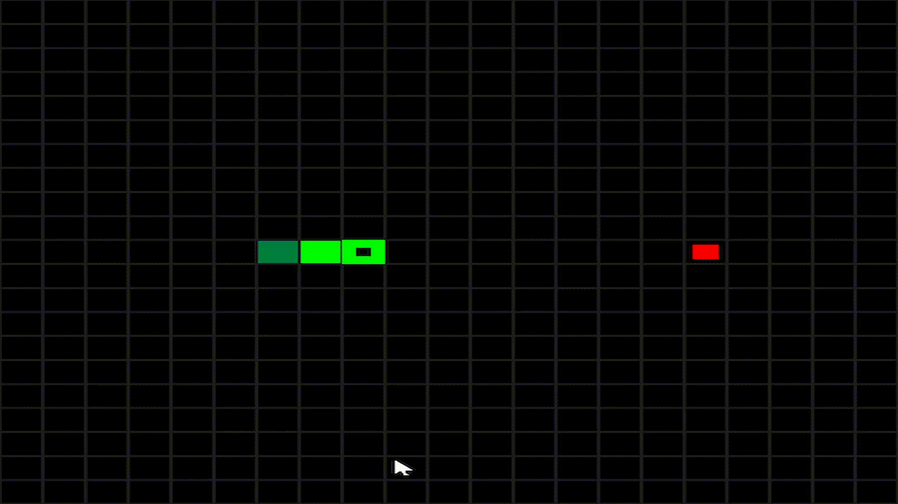

# Snake
A basic snake game made using pygame, a game development library for python. It features basic shapes, animations, sound effects and function usage. It is one of my starter projects which really taught me about game development elements and programming with functions.
## Controls
Use WASD or Arrow keys to move.  
Hold Space to speed up the board.  
Press Esc to quit.
## Features
- Classic Snake Recreation
- Score Tracking
- High Score Saving
- Sound Effects  

## Instructions
Run "pip install -r requirements.txt" to install the necessary libraries.  
Run "python main.py" to play the game.  
# Enjoy!